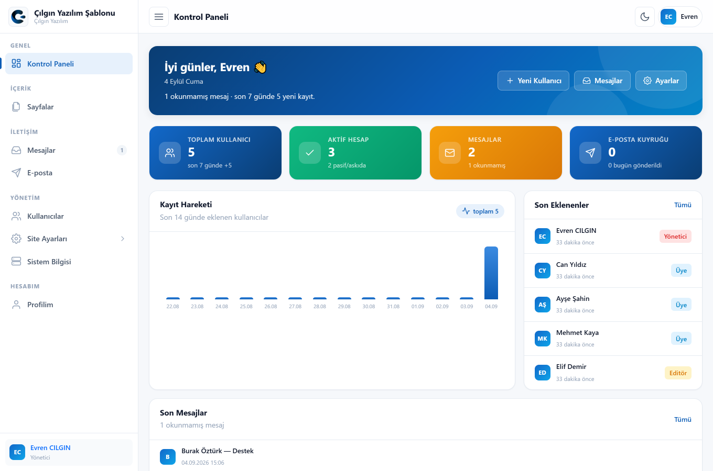
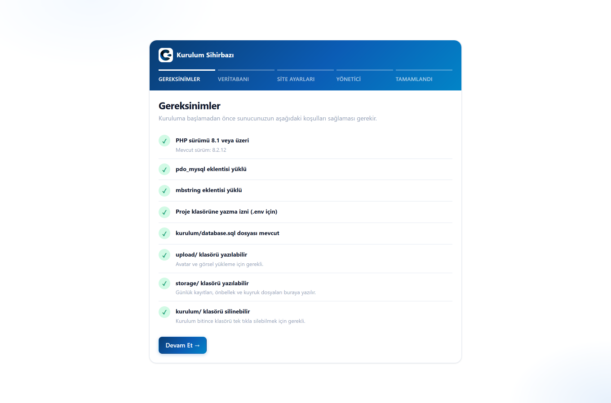
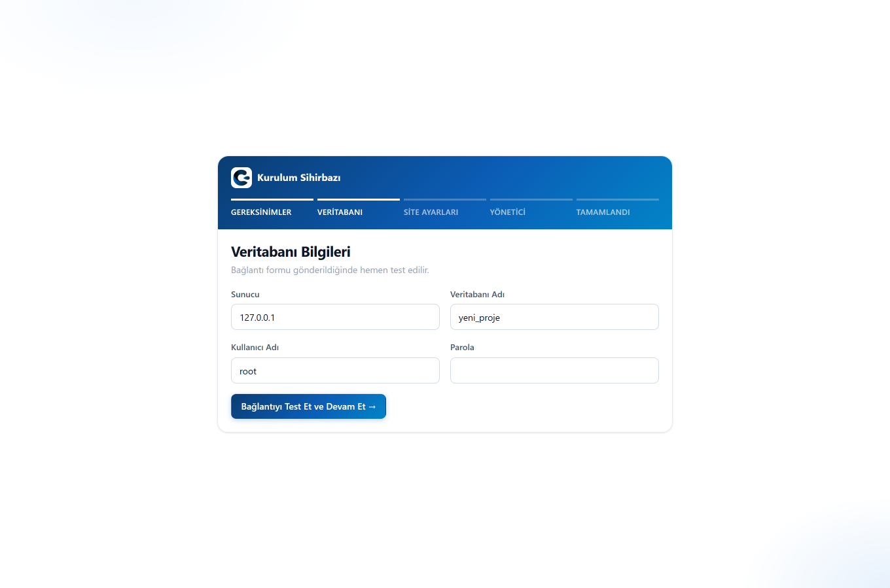
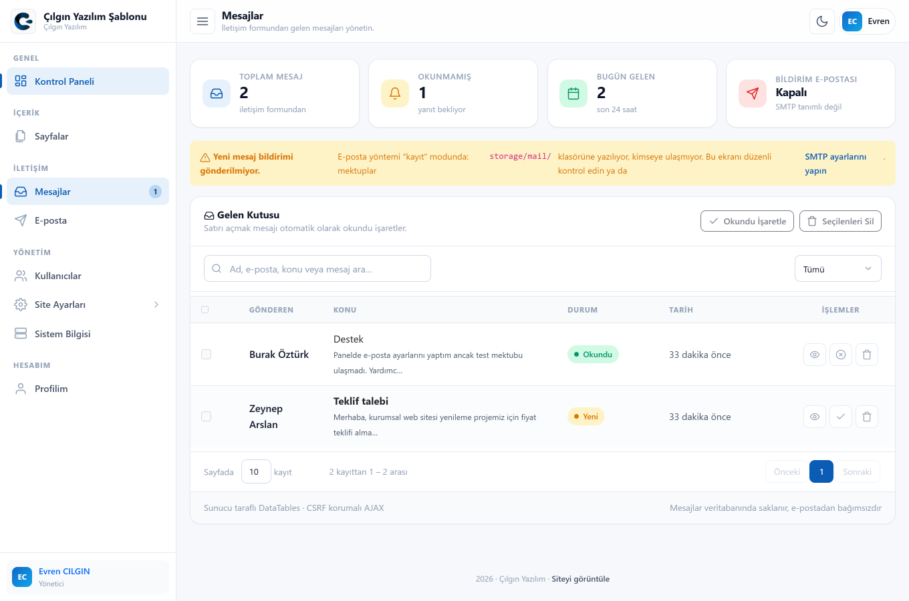
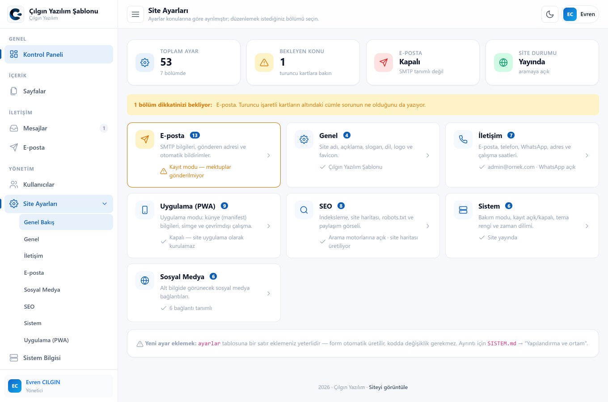
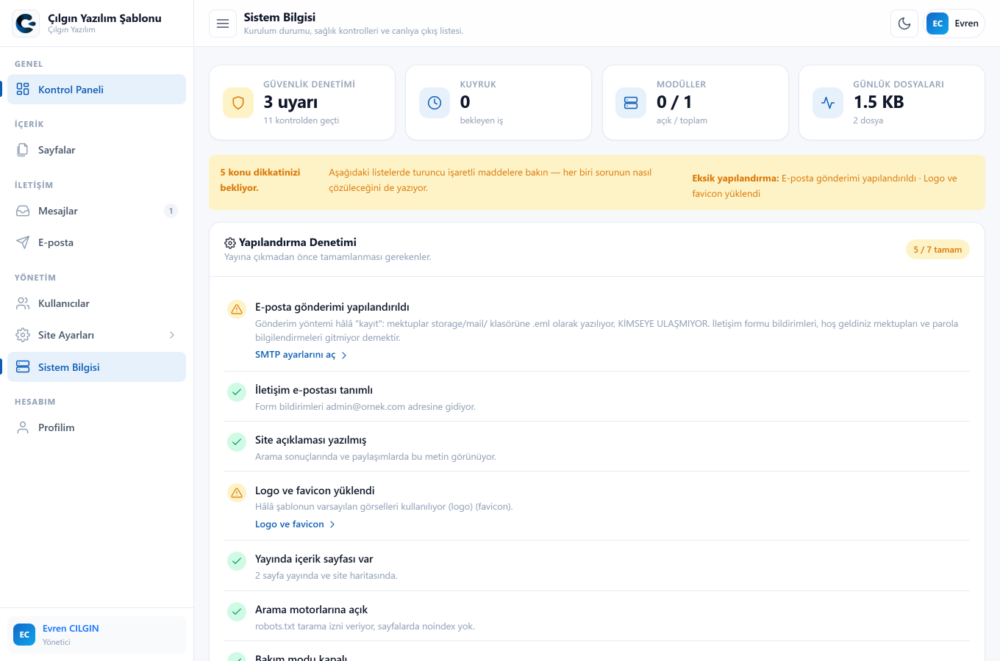
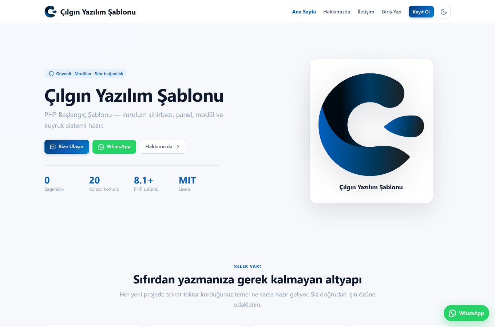
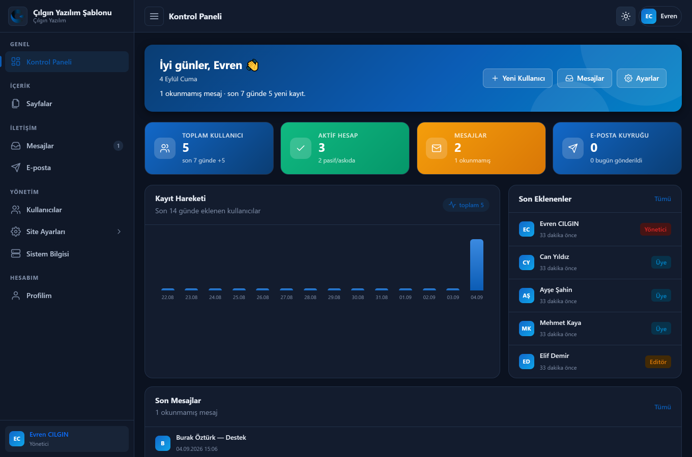
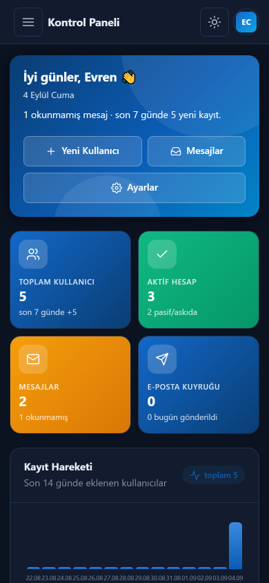

<div align="center">

# Çılgın Yazılım – PHP Başlangıç Şablonu

### Her yeni projeye buradan başlayın

**Kurulum sihirbazı · rol tabanlı panel · konsol · migration · kuyruk · olay · modül sistemi · REST API · PWA — hepsi hazır.**

[](https://github.com/CilginYazilim/cy-php-starter/releases)
[](https://php.net)
[](https://getbootstrap.com)
[](#)
[](LICENSE)

[**▶ Canlı Demo**](https://cilginyazilim.com/kutuphane/uygulama/cy-php-starter/) · [Kaynak Kütüphanesi](https://cilginyazilim.com/kutuphane/php-baslangic-sablonu) · [cilginyazilim.com](https://cilginyazilim.com)

**[📖 Sistem Kılavuzu → SISTEM.md](SISTEM.md)**
· **[💡 Örnek kodlar → Kod Kütüphanesi](https://cilginyazilim.com/kutuphane)**
· **[📦 Şablonun sayfası](https://cilginyazilim.com/kutuphane/php-baslangic-sablonu)**

</div>

---

<div align="center">

## Canlı Demo

**Kurulum yok, kayıt yok, indirme yok — tarayıcınızdan 3 saniyede deneyin.**

<a href="https://cilginyazilim.com/kutuphane/uygulama/cy-php-starter/"></a>
<a href="https://cilginyazilim.com/kutuphane/php-baslangic-sablonu"></a>
<a href="https://github.com/CilginYazilim/cy-php-starter/archive/refs/heads/main.zip"></a>

<br><br>

<a href="https://cilginyazilim.com/kutuphane/uygulama/cy-php-starter/" title="Canlı demoyu açmak için tıklayın">
  
</a>

<sub>▲ Görsele tıklayarak demoyu açabilirsiniz</sub>

</div>

> **`kurulum/` adresini açın; dört adımda çalışan bir site ve panel elde edin.**

---

## Ekran Görüntüleri

Aşağıdaki kareler bu depodaki kodun **kurulduktan sonraki** hâlidir; hepsi
`kurulum/` sihirbazı tamamlandıktan sonra, örnek veriyle çekilmiştir.

### Kurulum sihirbazı

Şablonun ayırt edici yanı burada başlar: `.env` dosyasını elle yazmaz,
veritabanını elle açmazsınız. Sihirbaz önce sunucunuzu denetler, sonra
şemayı kurar ve `.env` dosyasını sizin için üretir.

<table>
<tr>
<td width="50%"></td>
<td width="50%"></td>
</tr>
<tr>
<td align="center"><sub><b>1. adım</b> — gereksinim denetimi</sub></td>
<td align="center"><sub><b>2. adım</b> — veritabanı bağlantısı</sub></td>
</tr>
</table>

### Panel


<sub>Kontrol paneli. Kartlar, 14 günlük kayıt grafiği ve son mesajlar — hepsi veritabanından, sahte veri yok.</sub>

<table>
<tr>
<td width="50%"></td>
<td width="50%"></td>
</tr>
<tr>
<td align="center"><sub>Kullanıcılar — rol rozetleri, arama, toplu işlem</sub></td>
<td align="center"><sub>Mesajlar — iletişim formundan gelen kayıtlar</sub></td>
</tr>
<tr>
<td width="50%"></td>
<td width="50%"></td>
</tr>
<tr>
<td align="center"><sub>Site ayarları — form, ayar <b>tanımından</b> üretilir</sub></td>
<td align="center"><sub>Sistem bilgisi — güvenlik denetim listesi</sub></td>
</tr>
</table>

### Ön yüz, koyu tema ve mobil

<table>
<tr>
<td width="40%"></td>
<td width="40%"></td>
<td width="20%"></td>
</tr>
<tr>
<td align="center"><sub>Ön yüz</sub></td>
<td align="center"><sub>Koyu tema — tek CSS değişken seti</sub></td>
<td align="center"><sub>Mobil</sub></td>
</tr>
</table>

---

## Bu şablon nedir?

Her yeni PHP projesinde baştan yazdığınız teknik altyapıyı hazır sunar.
Belirli bir iş uygulaması **değildir**; ERP, CRM, CMS, blog, SaaS, REST
API ya da iç uygulama — hepsinin altına aynı sağlam temeli koyar.

**Composer yok, framework yok, CDN yok.** İndirin, `kurulum/` adresini
açın, birkaç adımda çalışan bir site + panel elde edin.

### Tek cümlelik felsefe

> Core, uygulamanın **ne iş yaptığını** bilmez. Yalnızca **nasıl
> çalıştığını** sağlar.

```php
// YANLIŞ — çekirdek iş mantığını biliyor
UserService::register($data);
ErpPersonel::olustur($user);

// DOĞRU — çekirdek duyurur, modül dinler
Events::dispatch(new UserRegistered($user));
```

---

## Neler hazır?

| Katman | İçerik |
|---|---|
| **Kurulum** | Adım adım sihirbaz · `.env` üretimi · tabloları **ve migration'ları** kurar · yönetici hesabı · isteğe bağlı örnek veri · tek tuşla kendini silme |
| **Kimlik** | Giriş/kayıt/çıkış · **beni hatırla** · rol-yetki · kaba kuvvet koruması · sertleştirilmiş oturum |
| **Yönlendirme** | Temiz SEO adresleri · `{parametre}` · GET/POST/PUT/PATCH/DELETE · gruplar |
| **Hata yönetimi** | Merkezi işleyici · ölümcül hata yakalama · geliştirici ekranı · güvenli 404/403/419/500 |
| **Günlük** | Kanal bazlı (`app` `error` `security` `auth` `mail` `queue`) · parola maskeleme · rotasyon |
| **Veritabanı** | Migration + rollback + parti · seeder · Repository deseni |
| **Depolama** | `public` / `private` disk · 9 katmanlı yükleme güvenliği · güvenli indirme |
| **Önbellek** | Dosya / veritabanı / kapalı sürücüleri · `remember()` |
| **Olaylar** | Yayıncı-dinleyici · hata yalıtımı · test için `fake()` |
| **Kuyruk** | Veritabanı kuyruğu · atomik ayırma · katlanan yeniden deneme |
| **Zamanlayıcı** | Tek cron satırı · üst üste binme koruması |
| **E-posta** | SMTP / mail() / diske yazma · toplu gönderim · kuyruk · panel arayüzü |
| **REST API** | Standart yanıt zarfı · Bearer anahtarı · hız sınırı · sayfalama |
| **Modüller** | Aç/kapa · kendi rotaları, tabloları, görünümleri, menüsü |
| **PWA** | Panelden yönetilen künye (ad, simge, açılış adresi, görüntüleme modu, renk) · servis çalışanı · çevrimdışı sayfa |
| **İçerik** | **Sayfa yönetimi** — zengin metin editörü · adres (slug) üretimi · taslak/yayın · menü · sayfa bazlı SEO |
| **SEO** | Temiz adresler · canonical · Open Graph · başlık şablonu · dinamik sitemap.xml & robots.txt (panelden ek kural) |
| **Ayarlar** | Bölüm bölüm sayfalar · durum özetli genel bakış · kapsamlı kaydetme · logo **ve favicon** yükleme |
| **İletişim** | Form + spam koruması · **WhatsApp düğmesi** (hazır mesajla) · sosyal medya bağlantıları |
| **Tema** | Tek renk seçin, panelin ve sitenin tamamı yeniden renklensin |
| **Mobil** | Ön yüz ve panelin tamamı mobil öncelikli · 44px dokunma hedefleri · yapışkan menü · iOS yakınlaştırma ve çentik payı çözülmüş |
| **Konsol** | `php cy` — 20 komut, üreteçler dahil |

---

## Kurulum

### Gereksinimler

- PHP **8.1+** (`pdo_mysql`, `mbstring`, `json`; `gd` ve `fileinfo` önerilir)
- MySQL 5.7+ / MariaDB 10.3+
- Apache (`mod_rewrite`) ya da Nginx

### Adımlar

```bash
git clone https://github.com/CilginYazilim/cy-php-starter
```

1. Klasörü sunucunuza koyun
2. Tarayıcıda **`http://siteniz/kurulum/`** adresini açın
3. Sihirbazı tamamlayın
4. Son adımdaki düğmeyle **`kurulum/` klasörünü silin**

Hepsi bu. **Komut satırı gerekmez** — sihirbaz `.env` dosyasını yazar,
tabloları kurar, migration'ları çalıştırır (önbellek, kuyruk, API
anahtarları) ve yönetici hesabınızı açar. Paylaşımlı hostingde de
eksiksiz kurulur.

> **Örnek veri:** Son adımda "Örnek verileri de yükle" kutusu vardır.
> Şablonu ilk kez deniyorsanız işaretleyin — listeleri ve filtreleri
> dolu görürsünüz (demo parolası `Demo1234!`). Gerçek bir projeye
> başlıyorsanız **boş bırakın**, veritabanınız tertemiz kalır.

> **`mod_rewrite` yoksa:** `.env` içinde `APP_PRETTY_URLS=false` yapın.
> Uygulama `index.php?r=…` biçimine döner, başka hiçbir şey değişmez.

---

## Klasör yapısı

```
├── index.php               Web giriş noktası
├── cy                      Konsol giriş noktası (php cy …)
├── sw.js                   Servis çalışanı (PWA)
│
├── app/
│   ├── bootstrap.php       Web + CLI ortak önyükleme
│   ├── Core/               ÇEKİRDEK (iş mantığı içermez)
│   │   ├── Api/ Cache/ Console/ Database/ Events/ Exceptions/
│   │   ├── Log/ Mail/ Modules/ Queue/ Schedule/ Storage/
│   │   └── Auth Config Csrf Database Env ErrorHandler Flash
│   │       Middleware RateLimiter Request Response Router
│   │       Session Setting Uploader Url Validator View
│   ├── Events/ Listeners/ Jobs/
│   ├── Models/             Entity'ler (ORM DEĞİL) + Role
│   ├── Repositories/       SQL yalnızca burada
│   ├── Http/Controllers/   Panel · Api · Site
│   └── Support/helpers.php
│
├── config/                 app db session log cache queue api storage
│                           upload security validation events
├── routes/                 web.php · events.php · schedule.php
├── database/               migrations/ · seeders/
├── modules/                Eklenebilir modüller (Ornek/ = çalışan örnek)
├── views/                  layouts · partials · emails · errors · sayfalar
├── assets/                 css · js · images (CDN yok)
├── storage/                logs · cache · files · mail (web'e kapalı)
├── upload/                 Yüklenen görseller (PHP çalıştırma kapalı)
└── kurulum/                Sihirbaz + database.sql + demo.sql (sonra SİLİN)
```

### İsteğin yolculuğu

```
Tarayıcı → .htaccess → index.php → bootstrap → Session/Güvenlik
   → Ayarlar → Modüller → Router → Middleware → Controller
   → Repository → View / JSON
```

---

## Konsol

```bash
php cy                      # tüm komutlar
php cy yardim migrate       # ayrıntılı yardım
```

```bash
# Şema
php cy make:migration "urunlere aciklama ekle"
php cy migrate                     php cy migrate --pretend
php cy migrate:status              php cy migrate:rollback --step=3
php cy migrate:fresh --seed

# Üreteçler
php cy make:module Stok            # çalışır durumda CRUD modülü
php cy make:controller Urun --api
php cy make:model Urun --repository
php cy make:seeder Urun

# Modüller
php cy module                      php cy module --enable=Stok

# Bakım
php cy cache:clear --expired       php cy config:cache
php cy log:purge --list            php cy queue:work --max=30
php cy schedule:run --list         php cy mail:test ali@ornek.com
```

**Cron — tek satır yeter:**

```cron
* * * * * cd /yol/site && php cy schedule:run >> /dev/null 2>&1
```

---

## Modül eklemek

```bash
php cy make:module Stok
php cy module --enable=Stok
php cy migrate
```

Panelde `/panel/stok` hazır: listeleme, ekleme, silme. Modül kendi
rotalarını, tablolarını, görünümlerini ve menü girdisini taşır.

**Kapalı modül hiç yüklenmez** — rotaları tanımlanmaz, sınıfları
yüklenmez, olayları dinlenmez.

---

## Sık kullanılanlar

```php
// Adres ve varlık (hepsi köke göreli)
url('panel/ayarlar');            asset('css/site.css');

// Ayarlar
config('db.host');               // config/ dosyaları (geliştirici)
setting('site_adi');             // ayarlar tablosu (yönetici, panelden)

// Yetki
can('users.delete');

// Marka rengi (Ayarlar → Sistem → Tema Rengi)
Theme::brand();                  // '#7c3aed' — doğrulanmış
Theme::styleTag();               // düzenlere basılan <style> bloğu

// Günlük
Logger::info('…', ['id' => 3], 'auth');
Logger::security('Şüpheli istek', ['ip' => $ip]);

// Önbellek
Cache::remember('rapor', 900, fn () => $agirHesap());

// Olay
Events::dispatch(new UserRegistered($user));

// Kuyruk
Queue::push(new RaporUret(3));

// Dosya
Uploader::store($request->file('belge'), ['disk' => 'private', 'group' => 'belge']);

// API yanıtı
ApiResponse::paginated($items, $total, $page, $perPage);
```

---

## Örnek kodlar ve belgeler

Şablonun her parçası için çalışan örnek kod, açıklamalı anlatım ve
kopyalanabilir parçacıklar **Çılgın Yazılım Kod Kütüphanesi**'nde:

| Kaynak | Adres |
|---|---|
| Kod kütüphanesi (tüm konular) | <https://cilginyazilim.com/kutuphane> |
| Bu şablonun sayfası | <https://cilginyazilim.com/kutuphane/php-baslangic-sablonu> |
| Depo ve sürümler | <https://github.com/CilginYazilim/cy-php-starter> |
| Mimari ve genişletme rehberi | [SISTEM.md](SISTEM.md) |

Bu bağlantılar sitenin **alt bilgisinde de sabit durur** (Örnek Kodlar
sütunu); kurduğunuz projede gezinirken bir tık uzaktadır.

---

## Mobil

Ön yüz ve panel **ayrı ayrı mobil için tasarlanmıştır** — masaüstü
düzeninin küçültülmüş hâli değildir.

| Konu | Ön yüz | Panel |
|---|---|---|
| Menü | Yapışkan üst çubuk; hamburger açılır panel, kendi içinde kayar | Sol menü off-canvas çekmeceye döner (arka plan örtüsü + ESC) |
| Tema düğmesi | Hamburgerin **dışında** — menüyü açmadan tek dokunuş | Üst çubukta sabit |
| Dokunma hedefleri | Düğmeler ≥ 44px, menü satırları 46px | Düğmeler ≥ 44px, sayfalama 40px |
| Formlar | Alanlar 16px — iOS'un otomatik yakınlaştırması engellenir | Aynı |
| Yerleşim | Hero eylemleri tek sütun; iletişimde **form önce** gelir | Özet kartlar 2 sütun; tablolarda ikincil sütunlar ad hücresine iner |
| Modallar | — | Alttan açılan sayfa görünümü, gövde kendi içinde kayar |
| Çentikli ekran | `env(safe-area-inset-*)` payları | Aynı |

Kırılma noktaları iki yüzde de aynıdır: `992px` (tablet) ve `768px`
(telefon); `360px` altı için ayrıca sadeleştirme vardır.

---

## Güvenlik

| Tehdit | Önlem |
|---|---|
| SQL Injection | Hazırlıklı sorgular; sıralama sütunu beyaz listeden |
| XSS | `e()` kaçışlama + CSP (`script-src 'self'`, satır içi JS yok) |
| CSP çakışması | Analytics kodunun adresi ve sha256 özeti otomatik tanıtılır; politika gevşetilmez |
| CSRF | Her POST'ta token (form alanı veya `X-CSRF-Token`) |
| Oturum çalma | `httponly` + `samesite` + `secure` + parmak izi + yenileme |
| Kaba kuvvet | Hız sınırı + kilit (kimlik+IP) |
| Path traversal | Segment bazlı doğrulama + `realpath()` |
| Kötücül yükleme | Gerçek MIME + beyaz/kara liste + rastgele ad + GD yeniden üretimi |
| Dosya ifşası | `app/` `config/` `storage/` `views/` `.env` `cy` web'e kapalı |
| Bilgi sızması | Yayında yığın izi ve dosya yolu gösterilmez |

**Panel → Sistem Bilgisi** sayfası bunların canlı denetimini yapar ve
her sorunun nasıl çözüleceğini yazar.

---

## Canlıya çıkış

```bash
# .env
APP_ENV=production
APP_DEBUG=false
LOG_LEVEL=info

php cy config:cache && php cy migrate
```

- [ ] `kurulum/` klasörü silindi
- [ ] HTTPS aktif
- [ ] `storage/` ve `upload/` yazılabilir
- [ ] `php cy mail:test` başarılı
- [ ] Cron kuruldu
- [ ] Sistem Bilgisi sayfasındaki tüm denetimler yeşil

### Nginx kullanıyorsanız

```nginx
location / {
    try_files $uri $uri/ /index.php?$query_string;
}

location ~ ^/(app|config|storage|views|database|modules|kurulum)/ { deny all; }
location ~ /\.env  { deny all; }
location ~ ^/cy$   { deny all; }

location ~* ^/upload/.*\.php$ { deny all; }
```

---

## Yeni projeye başlarken

```bash
git clone https://github.com/CilginYazilim/cy-php-starter yeni-proje
cd yeni-proje && rm -rf .git

# kurulum/ adresini aç, sihirbazı tamamla
# ("Örnek verileri de yükle" kutusunu işaretlemeyin)

rm -rf modules/Ornek app/Jobs/OrnekIs.php

php cy make:module KendiModulun
```

Ardından Panel → **Site Ayarları**'ndan site adını, logoyu ve tema
rengini kendinize göre ayarlayın; arayüz anında yeni renginizi alır.

---

## Sürüm

Sürüm numarası **kodda, tek yerde** durur:

```php
// config/app.php
'version' => '1.1.0',
```

`Panel → Sistem Bilgisi` sayfası bu değeri okur. Şablonu güncellediğinizde
numara kendiliğinden gelir; veritabanında ayrıca tutulmaz.

### 1.1.0

**Mobil**

- Ön yüz menüsü yapışkan hâle geldi; hamburger açılır panel kendi içinde
  kayıyor, simgesi açıkken çarpıya dönüyor
- Tema düğmesi hamburgerin dışına alındı — menüyü açmadan erişilebiliyor
- Ön yüzdeki düğme ve menü satırları 44–46px dokunma hedefine çıkarıldı
- Ön yüz form alanlarına 16px kuralı eklendi (iOS'un otomatik
  yakınlaştırması artık düzeni bozmuyor); daha önce yalnızca panelde vardı
- Ana sayfadaki hero eylemleri telefonda tek sütuna iniyor
- İletişim sayfasında telefonda **form önce**, bilgi kartları sonra geliyor
- Alt bilgi sütunları telefonda alt alta diziliyor; sabit WhatsApp düğmesi
  artık alt bilginin son satırını kapatmıyor
- Panelde özet kartların tek sütuna inme sınırı 400px'ten 360px'e çekildi —
  eski sınır iPhone 12/13/14 (390px) ve SE (375px) dahil neredeyse her
  telefonu kapsıyor, kontrol paneli gereksiz yere uzuyordu

**Düzeltmeler**

- `site.css` ile `site-sections.css` arasındaki çakışan kurallar
  temizlendi. Bunlardan biri telefonda hero kartının logosunu tamamen
  gizliyordu (`.cy-hero__logo { display: none }`)
- Sürüm numarası tek kaynağa indirildi. Üç farklı yerde üç farklı değer
  duruyordu: `kurulum/database.sql` "2.1.0", Sistem Bilgisi varsayılanı
  "1.0.0", GitHub sürüm etiketi "v1.0.0"

**Eklenenler**

- Alt bilgide **Örnek Kodlar** sütunu: kod kütüphanesi, şablonun sayfası
  ve depo bağlantısı
- `icon()` yardımcısına `book` ve `code` simgeleri

> **Güncelliyorsanız:** `php cy migrate` çalıştırın. Tek migration var,
> veritabanındaki ölü `sistem_surum` ayarını siler.

---

<div align="center">

**Ayrıntılı mimari, tasarım kararları ve genişletme rehberi için:
[SISTEM.md](SISTEM.md)**

**Örnek kodlar: [cilginyazilim.com/kutuphane](https://cilginyazilim.com/kutuphane)**

MIT Lisansı · **Çılgın Yazılım** · [cilginyazilim.com](https://cilginyazilim.com)

</div>
