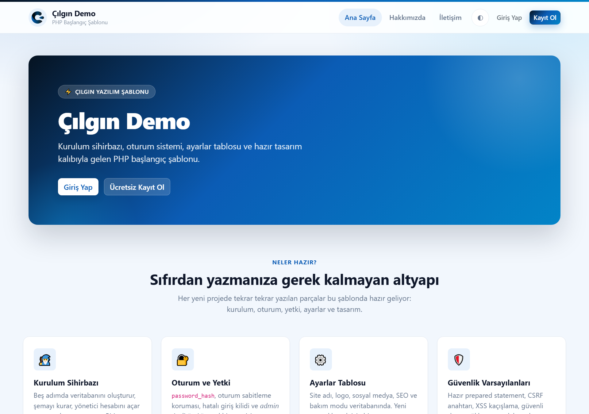
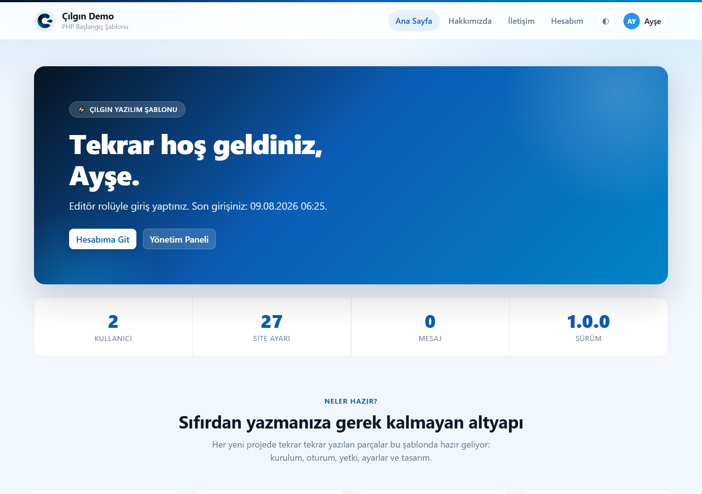
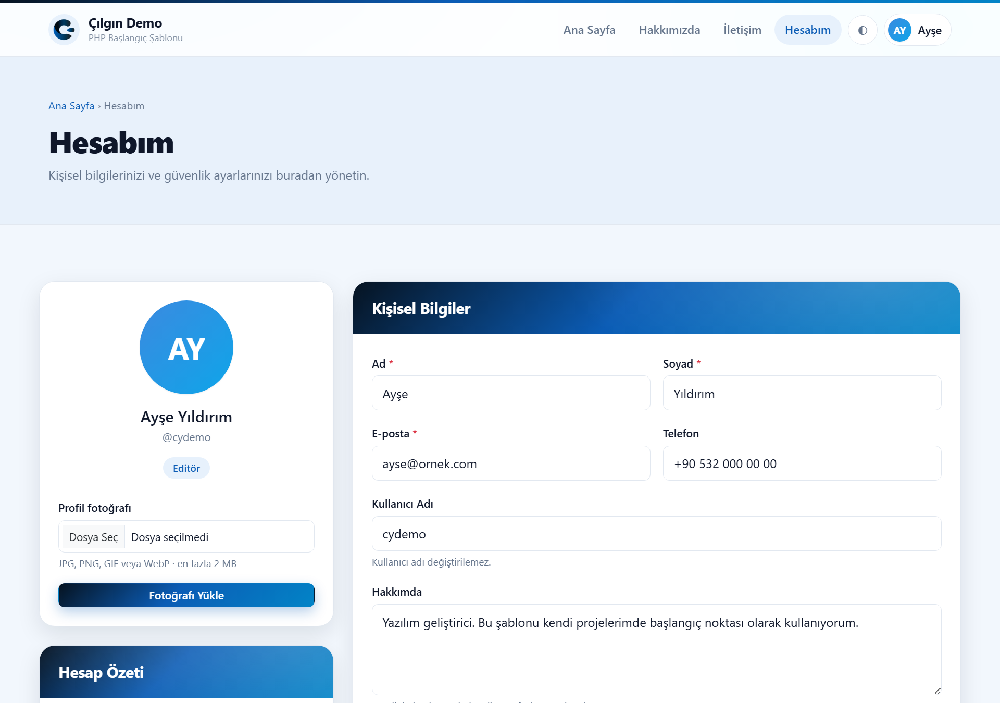
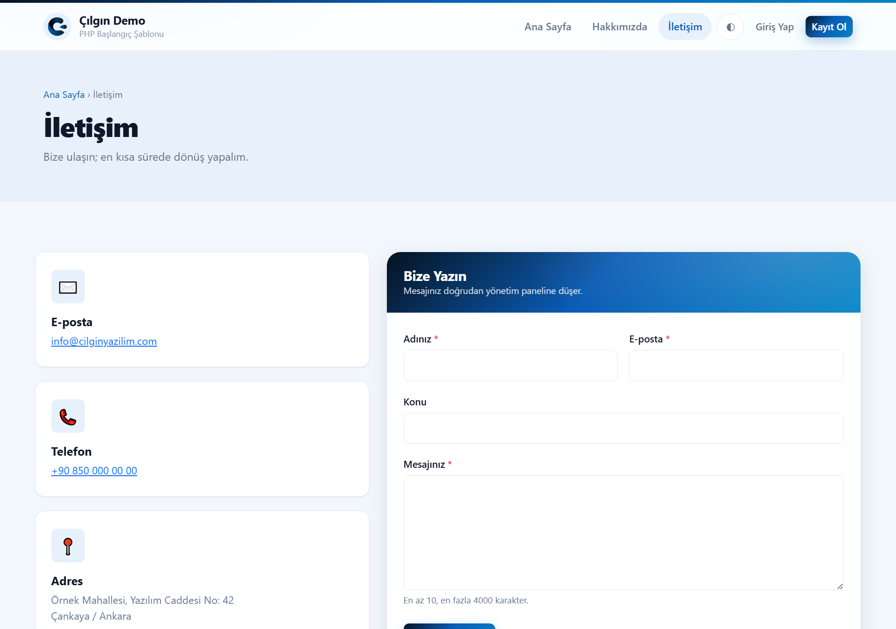
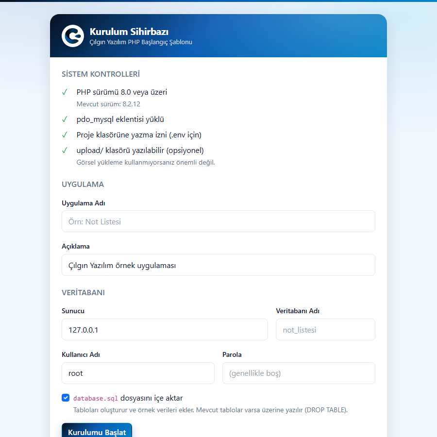
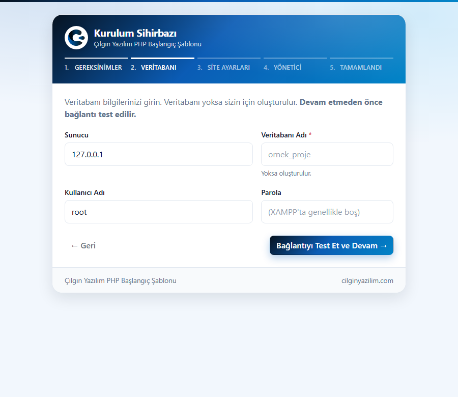
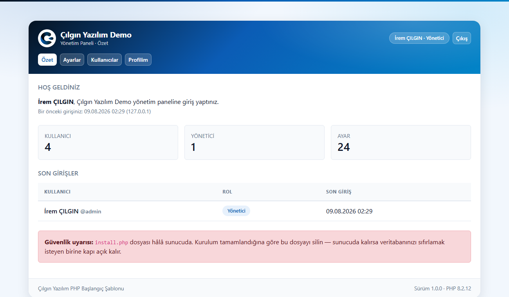
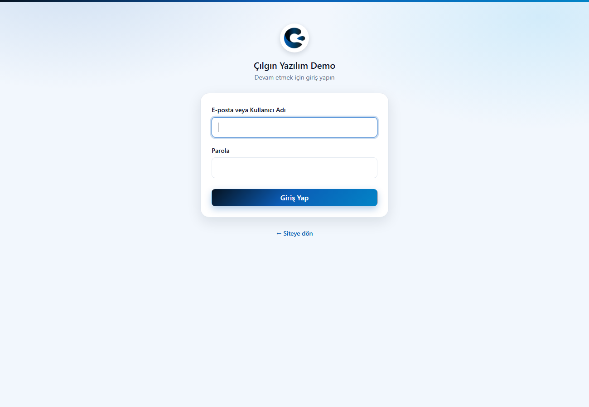
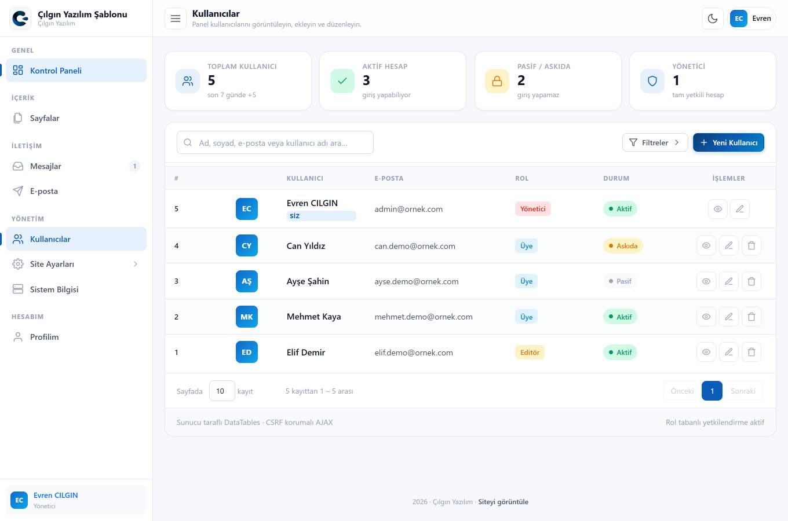

<div align="center">

# Çılgın Yazılım – PHP Başlangıç Şablonu

### Her yeni örnek projeye buradan başlayın

**Kurulum sihirbazı + oturum sistemi + yönetim paneli + tasarım kalıbı hazır. Siz sadece işin özüne odaklanın.**

[](https://php.net)
[](https://getbootstrap.com)
[](LICENSE)

[cilginyazilim.com](https://cilginyazilim.com)

</div>

---

## Bu Şablon Nedir?

Her yeni PHP örneği yazarken aynı şeyleri tekrar kurmak zorunda kalmayın diye hazırlandı. İçinde şunlar **çalışır halde** gelir:

| Hazır gelen | Açıklama |
|-------------|----------|
| 🧙 **Adım adım kurulum sihirbazı** | `kurulum/` — 5 adımda veritabanını oluşturur, şemayı kurar, site ayarlarını ve **yönetici hesabını** yazar. Bitince **kendi klasörünü siler**. |
| 🔑 **Oturum ve yetki sistemi** | Giriş/çıkış/kayıt, `password_hash`, rol tabanlı yetki (`admin` / `editor` / `uye`), kaba kuvvet koruması |
| 🖥️ **Hazır ön yüz (site)** | Ana sayfa, Hakkımızda, İletişim, Kayıt, Giriş, Hesabım ve 404 — hepsi oturum durumuna göre değişir |
| ⚙️ **Ayarlar tablosu** | Site adı, iletişim, sosyal medya, SEO, bakım modu… `setting('site_adi')` ile okunur |
| 🗂️ **Yönetim paneli** | Özet, ayarlar, kullanıcı yönetimi (CRUD), profil sayfaları hazır |
| ✉️ **İletişim formu** | Mesajlar veritabanına düşer (SMTP gerekmez); bal küpü + hız sınırı ile spam koruması |
| 🌗 **Açık / koyu tema** | Sistem ayarını izler, kullanıcı düğmeyle değiştirir, tercih tarayıcıda saklanır |
| 🎨 **Tasarım kalıbı** | `cilginyazilim.css` — marka renkleri, kart, buton, tablo, modal, toast, koyu tema |
| 🔒 **CSRF koruması** | Token üretimi ve `hash_equals` ile sabit zamanlı doğrulama |
| 🛡️ **Güvenli PDO kurulumu** | `EMULATE_PREPARES=false`, exception modu, utf8mb4 + Türkçe sıralama |
| 📤 **Güvenli dosya yükleme** | Tür içerikten doğrulanır, dosya adı sunucuda üretilir, `.htaccess` korumalı klasör |
| 🔀 **AJAX yönlendirici** | Tek uç nokta, `action` tabanlı, tek noktada hata yakalama |
| 🧩 **Hazır CRUD örneği** | `list`/`add`/`edit`/`fetch`/`delete` — yorum satırından çıkarıp tablo adını değiştirmeniz yeterli |
| ✅ **Doğrulama fonksiyonları** | Metin, ad, e-posta, kullanıcı adı, parola, ID |
| 📦 **Yerel kütüphaneler** | jQuery, Bootstrap 5, DataTables — CDN yok, çevrimdışı çalışır |
| 📄 **Belge taslakları** | README taslağı, `.gitignore`, `.env.example`, MIT lisansı |

> **Bağımlılık yok.** Composer yok, npm yok. Klonla, çalıştır.

---

## Ekran Görüntüleri

### Ön yüz (site)

Kurulum biter bitmez çalışan, oturum durumuna göre değişen bir site: yapışkan üst menü, hero alanı, özellik kartları ve alt bilgi. Site adı, slogan, tema rengi, iletişim ve sosyal medya bağlantıları doğrudan `ayarlar` tablosundan gelir.



Aynı sayfa, giriş yapılmış halde: karşılama metni kişiselleşir, sağ üstte kullanıcı menüsü çıkar, yetkisi varsa "Yönetim Paneli" bağlantısı görünür.



**Hesabım** sayfasında üye kendi bilgilerini düzenler, profil fotoğrafı yükler ve parolasını değiştirir. Rol ve durum alanları bilerek yoktur — kimse kendi yetkisini yükseltemesin diye.



**İletişim** formundan gelen mesajlar `mesajlar` tablosuna düşer; e-posta sunucusu (SMTP) ayarlamanız gerekmez.



### Kurulum sihirbazı (adım adım)

Beş adım: **Gereksinimler → Veritabanı → Site Ayarları → Yönetici → Tamamlandı.**
Veritabanı bağlantısı 2. adımda hemen test edilir; her şeyi doldurduktan sonra "parola yanlış" sürprizi yaşamazsınız.





### Yönetim paneli

Kurulum biter bitmez çalışan bir panel: özet, ayarlar, kullanıcı yönetimi ve profil.



Ayarlar formundaki **hiçbir alan elle yazılmamıştır** — hepsi `ayarlar` tablosundaki `tip`, `etiket`, `grup` sütunlarından otomatik üretilir. Yeni ayar eklemek için tabloya bir satır eklemeniz yeterli.





---

## Hızlı Başlangıç

```bash
# 1) Şablondan yeni proje oluştur (GitHub'da "Use this template" butonu)
git clone https://github.com/CilginYazilim/cy-php-starter.git yeni-projem
cd yeni-projem

# 2) Şablonun git geçmişini temizle, kendi geçmişini başlat
rm -rf .git
git init

# 3) Çalıştır
php -S 127.0.0.1:8000
```

Tarayıcıda `http://127.0.0.1:8000/` adresini açın. Veritabanı henüz yoksa
otomatik olarak kurulum sihirbazına yönlendirilirsiniz. Sihirbaz beş adımda
veritabanını oluşturur, `ayarlar` ve `kullanicilar` tablolarını kurar, site
bilgilerinizi kaydeder ve **yönetici hesabınızı** açar. Ardından `giris.php`
üzerinden panele girebilirsiniz.

Son adımdaki **"Kurulum klasörünü sil"** butonuna basınca `kurulum/`
klasörü içindeki her şeyle birlikte silinir; proje kökünde kuruluma ait
tek bir dosya bile kalmaz.

> **Elle kurulum tercih ederseniz:** sihirbazı hiç açmadan
> `mysql -u root -p < kurulum/database.sql` ile veritabanını kendiniz
> oluşturabilir, `.env.example` dosyasını `.env` olarak kopyalayıp
> elle doldurabilirsiniz. İkisi de aynı sonuca gider. (Bu durumda
> yönetici hesabını da kendiniz eklemeniz gerekir — bkz. `database.sql`
> dosyasının sonundaki not.)

---

## Yeni Proje Kontrol Listesi

Şablonu kopyaladıktan sonra sırayla:

- [ ] **Kurulum sihirbazını çalıştırın** (`kurulum/`) — site adı, veritabanı ve yönetici hesabı burada belirlenir
- [ ] **`kurulum/database.sql`** → `ayarlar`, `kullanicilar` ve `mesajlar` tablolarını KORUYUN, kendi tablolarınızı bunların altına ekleyin
- [ ] **Ayarlar** → projeye özel ayarları `ayarlar` tablosuna satır olarak ekleyin (panelde otomatik görünür)
- [ ] **`index.php`** → "TANITIM BÖLÜMLERİ" arasındaki kısmı silin, kendi içeriğinizi yazın (kabuk `_ust.php`/`_alt.php` kalsın)
- [ ] **`_ust.php`** → `$siteMenu` dizisine kendi sayfalarınızı ekleyin
- [ ] **`hakkimizda.php` / `iletisim.php`** → gerekmiyorsa silin, menüden de çıkarın
- [ ] **`system/ajax.php`** → tam CRUD lazımsa dosyanın alt kısmındaki yorumlu `handle_list/save/fetch/delete` bloğunu açıp `items` yerine kendi tablonuzu yazın; farklı bir şey lazımsa kendi `case`'lerinizi ekleyin. `ping`'i sonunda silin
- [ ] **`system/function.php`** → CRUD bloğunu açtıysanız oradaki `find_item()` örneğini de yorumdan çıkarın; farklı sorgular için "PROJEYE ÖZEL" bölümüne yazın
- [ ] **`assets/css/style.css`** → projeye özel stiller (⚠️ `cilginyazilim.css`'e dokunmayın)
- [ ] **`README.md`** → `docs/README-taslak.md` dosyasını buraya kopyalayıp doldurun
- [ ] **`docs/screenshots/`** → ekran görüntülerini ekleyin
- [ ] **`.gitignore`** → örnek görselleri paylaşacaksanız `upload/*` satırını yorumlayın
- [ ] **Canlıya çıkmadan önce `kurulum/` klasörünü silin** — sihirbazın son adımındaki buton bunu tek tıkla yapar (bkz. [Canlıya Alırken](#canlıya-alırken))

---

## Dosya Yapısı

```
.
├── _ust.php                   # SİTE KABUĞU: üst menü, oturum durumu, tema
├── _alt.php                   # SİTE KABUĞU: alt bilgi + ortak JS (CY nesnesi)
│
├── index.php                  # Ana sayfa (herkese açık)
├── hakkimizda.php             # Hakkımızda (metni ayarlardan gelir)
├── iletisim.php               # İletişim + mesaj formu (AJAX)
├── kayit.php                  # Kayıt ol (sistem_kayit_acik ayarına bağlı)
├── giris.php                  # Giriş sayfası
├── cikis.php                  # Çıkış (POST + CSRF korumalı)
├── hesabim.php                # Üye profili: bilgiler, avatar, parola
├── 404.php                    # Sayfa bulunamadı
│
├── .htaccess                  # Hata sayfası, güvenlik başlıkları, .env koruması
├── .env.example               # Elle kurulum için ortam değişkeni şablonu
├── README.md                  # Bu dosya (yeni projede değiştirin)
├── LICENSE                    # MIT
├── .gitignore                 # .env dahil, hassas dosyaları hariç tutar
│
├── kurulum/                   # KURULUM SİHİRBAZI (kurulum bitince silinir)
│   ├── index.php              # 5 adımlı sihirbaz + klasörü silme butonu
│   └── database.sql           # Şema: ayarlar + kullanicilar + mesajlar
│
├── yonetim/                   # YÖNETİM PANELİ (giriş gerektirir)
│   ├── _ust.php               # Ortak üst şablon: menü, yetki kontrolü
│   ├── _alt.php               # Ortak alt şablon: JS yardımcıları (CY nesnesi)
│   ├── index.php              # Özet / gösterge paneli
│   ├── ayarlar.php            # Ayar formu (tablodan otomatik üretilir)
│   ├── kullanicilar.php       # Kullanıcı CRUD (DataTables + modal)
│   └── profil.php             # Kendi profilini düzenleme
│
├── docs/
│   ├── README-taslak.md       # Yeni proje için README taslağı
│   └── screenshots/           # Ekran görüntüleri
│
├── system/
│   ├── config.php             # .env'i okur, PDO + altyapıyı yükler
│   ├── function.php           # Yardımcı fonksiyonlar (CSRF, doğrulama, JSON)
│   ├── settings.php           # setting(), settings_save() — ayar yönetimi
│   ├── auth.php               # auth_login(), require_role() — oturum/yetki
│   └── ajax.php               # AJAX yönlendirici
│
├── assets/
│   ├── css/
│   │   ├── bootstrap.min.css
│   │   ├── dataTables.bootstrap5.min.css
│   │   ├── cilginyazilim.css  # ⚠️ MARKA KALIBI — değiştirmeyin
│   │   └── style.css          # ◄ Projeye özel stiller buraya
│   ├── js/
│   │   ├── jquery-3.7.0.js
│   │   ├── bootstrap.bundle.js
│   │   ├── jquery.dataTables.min.js
│   │   └── dataTables.bootstrap5.min.js
│   └── images/
│       └── logo.png
│
└── upload/
    └── .htaccess              # Klasörde kod çalıştırmayı engeller
```

**Yükleme sırası önemlidir:**

```
CSS:  bootstrap → dataTables → cilginyazilim → style
JS:   jQuery → bootstrap.bundle → dataTables → dataTables.bootstrap5
```

---

## Tasarım Kalıbı Bileşenleri

`<body class="cy-app">` yazdıktan sonra kullanabileceğiniz sınıflar:

| Sınıf | Ne işe yarar |
|-------|--------------|
| `.cy-card` / `__header` / `__body` / `__footer` | Gradyan başlıklı ana kart |
| `.cy-brand` / `.cy-brand__mark` | Logo + başlık bloğu |
| `.cy-btn` + `--primary` \| `--onbrand` \| `--glass` | Marka butonları |
| `.cy-btn-icon` + `--view` \| `--edit` \| `--delete` | Tablo içi ikon butonları |
| `.cy-actions` | İkon butonlarını yan yana dizer |
| `.cy-table` | Marka görünümlü tablo |
| `.cy-avatar` / `--initial` / `--lg` | Profil görseli ve baş harf rozeti |
| `.cy-badge` + `--glass` \| `--soft` | Rozetler |
| `.cy-modal` | Gradyan başlıklı modal |
| `.cy-detail` | Etiket/değer listesi |
| `.cy-toast` + `--success` \| `--danger` \| `--info` | Bildirim balonları |
| `.cy-muted` / `.cy-nowrap` / `.cy-footer-note` | Yardımcı sınıflar |

### Renk değiştirmek

Tüm bileşenler CSS değişkenlerinden beslenir. `style.css` içine yazmanız yeterli:

```css
:root {
    --cy-brand-600: #0b5cb5;   /* Ana marka rengi */
    --cy-accent:    #0ea5e9;   /* Vurgu rengi     */
}
```

### Koyu tema

Ziyaretçinin işletim sistemi koyu temadaysa **otomatik** devreye girer.
Zorlamak için: `<html data-cy-theme="dark">` (veya `"light"`).

---

## Altyapıyı Kullanma

### Ayarları okumak ve yazmak

Ayarlar sayfa başına **tek sorguyla** okunup önbelleğe alınır; `setting()` fonksiyonunu yüz kere çağırsanız da veritabanına bir kez gidilir.

```php
echo setting('site_adi');                      // oku (yoksa boş)
echo setting('iletisim_eposta', 'yok@x.com');  // varsayılanla oku
if (setting_bool('sistem_bakim_modu')) { … }   // aç/kapa ayarı

settings_save($db, ['site_adi' => 'Yeni Ad']); // yaz (transaction'lı)
```

**Yeni bir ayar eklemek** için sadece tabloya satır ekleyin — yönetim panelinde doğru tipte alan **kendiliğinden** belirir, HTML yazmanız gerekmez:

```sql
INSERT INTO ayarlar (anahtar, deger, grup, tip, etiket, sira)
VALUES ('site_favicon', '', 'genel', 'metin', 'Favicon', 70);
```

Desteklenen `tip` değerleri: `metin`, `uzun_metin`, `sayi`, `eposta`, `url`, `secim`, `onay`, `renk`.

### Yeni bir site sayfası eklemek

Ön yüzdeki tüm sayfalar aynı kabuğu kullanır: `_ust.php` (üst menü, oturum
durumu, tema, SEO etiketleri) ve `_alt.php` (alt bilgi, ortak JavaScript).
Yeni bir sayfa üç satırla hazırdır:

```php
<?php
$sayfaBaslik   = 'Hizmetler';     // <title> ve sayfa başlığı
$aktifSayfa    = 'hizmetler';     // menüde hangi öğe vurgulansın
$sayfaAciklama = 'Neler yapıyoruz?';   // meta description (opsiyonel)

require __DIR__ . '/_ust.php';
?>

<section class="cy-section container">
    <h1 class="cy-section__title">Hizmetler</h1>
</section>

<?php require __DIR__ . '/_alt.php'; ?>
```

Menüde görünmesi için `_ust.php` içindeki `$siteMenu` dizisine bir satır ekleyin.
`oturum` anahtarı görünürlüğü belirler:

```php
$siteMenu = [
    ['anahtar' => 'hizmetler', 'baslik' => 'Hizmetler', 'url' => 'hizmetler.php', 'oturum' => null],
    // null  → herkese görünür
    // true  → sadece giriş yapmışlara
    // false → sadece giriş yapmamışlara
];
```

**Sayfaya özel JavaScript** yazacaksanız çıktı tamponu kullanın; kodunuz
jQuery yüklendikten sonra, `</body>` etiketinden hemen önce basılır:

```php
<?php ob_start(); ?>
<script>
$(function () {
    CY.post('benim_islemim', { id: 5 })      // CSRF anahtarı otomatik eklenir
      .done(function (c) { CY.notify(c.description); })
      .fail(function (x) { CY.notify('Hata', 'danger'); });
});
</script>
<?php $sayfaScript = ob_get_clean(); ?>
<?php require __DIR__ . '/_alt.php'; ?>
```

`CY` nesnesinin sunduğu yardımcılar: `CY.post()`, `CY.notify()`,
`CY.clearErrors()`, `CY.showErrors()`, `CY.token`.

### Sayfaları korumak

```php
require __DIR__ . '/system/config.php';

require_login();              // giriş yoksa giriş sayfasına yönlendir
require_role('admin');        // en az yönetici olmalı (editor/uye engellenir)

if (is_admin()) { … }         // şablon içinde koşullu gösterim
if (auth_at_least('editor')) { … }

$kullanici = auth_user($db);  // giriş yapanın tüm bilgileri
```

AJAX uç noktasında yönlendirme değil JSON hata dönmesi gerekir:

```php
require_csrf();
require_role_json('admin');   // 401 / 403 JSON döner
```

> **Roller:** `uye` < `editor` < `admin`. `require_role('editor')` yazarsanız `admin` de geçer — "en az bu rol" mantığıyla çalışır.

### Kurulmuş sistemde neler korunuyor?

Şablon, kendi kendini kilitleme ve yetki yükseltme hatalarına karşı **sunucu tarafında** korunur (arayüzdeki devre dışı butonlar sadece kolaylık):

- Kendi hesabınızın rolünü düşüremez veya pasife alamazsınız
- Kendinizi silemezsiniz
- Sistemdeki **son yöneticiyi** silemez veya yetkisini kaldıramazsınız
- Parola değiştirirken mevcut parola sorulur
- `duzenlenebilir = 0` olan ayarlar (örn. sürüm) formdan gönderilse bile yazılmaz
- Kullanıcı listesinde parola özeti **hiçbir zaman** tarayıcıya gönderilmez
- Kayıt formundan gelen `rol` alanı yok sayılır; yeni hesap **her zaman** `uye` olur
- Kayıtlar kapalıyken `kayit.php`'ye POST atılsa bile hesap açılmaz
- İletişim formu kapalıyken AJAX ucu da kapanır (sadece formu gizlemek yetmez)
- İletişim formunda bal küpü (honeypot) + oturum başına 60 saniyelik hız sınırı
- `kurulum/` klasörü ancak kurulum **gerçekten bitmişse** ve POST + CSRF ile silinebilir

### Hazır CRUD örneğini açmak (en hızlı yol)

`system/ajax.php` dosyasının alt kısmında, `handle_ping()`'den sonra tek büyük
yorum bloğu içinde **tam çalışan** bir CRUD örneği durur: `handle_list()`
(DataTables server-side listeleme), `handle_save()` (ekle+düzenle ortak),
`handle_fetch()` (tek kayıt) ve `handle_delete()`. Bu blok
[php-not-listesi-ornegi](https://github.com/CilginYazilim/php-not-listesi-ornegi)
ve [PHP PDO MySQL Ajax CRUD](https://github.com/CilginYazilim/PHP-PDO-MySQL-Ajax-CRUD-DataTables-Bootstrap-5-Modals)
projelerindeki güvenlik mantığıyla birebirdir; sadece jenerik bir `items`
tablosu üzerinden yazılmıştır.

Açmak için üç adım:

1. `system/ajax.php` içindeki `/* ... */` yorum işaretlerini kaldırın
   (blok, `handle_list()`'ten `handle_delete()`'in kapanışına kadar sürer)
2. `system/function.php`'nin en altındaki `find_item()` örneğini de
   yorumdan çıkarın — CRUD bloğu bu fonksiyonu çağırır
3. `switch` bloğundaki hazır case'lerin yorumunu kaldırın:
   ```php
   case 'list':   handle_list($db);   break;
   case 'add':
   case 'edit':   handle_save($db, $action); break;
   case 'fetch':  handle_fetch($db);  break;
   case 'delete': handle_delete($db); break;
   ```

Sonra `items` tablo adını ve `title`/`description` sütunlarını kendi
şemanıza göre değiştirin (`kurulum/database.sql`'de de aynı isimleri kullanın).
Görsel yükleme kullanmıyorsanız `handle_save()` içindeki `$hasNewImage`
bloğunu silin.

> Her iki blok da (CRUD ve `find_item()`) tek bir yorum içinde yazıldığı
> için içlerine **iç içe** `/* */` eklemeyin — C-stili yorumlar iç içe
> geçemez, ilk `*/` tüm bloğu erken kapatır ve dosya bozulur.

### Yeni bir AJAX işlemi eklemek

**1.** `system/ajax.php` içindeki `switch` bloğuna ekleyin:

```php
case 'kaydet':
    handle_kaydet($db);
    break;
```

**2.** Fonksiyonu yazın:

```php
function handle_kaydet(PDO $db): void
{
    require_csrf();   // ◄ Veri değiştiren her işlemde İLK SATIR

    [$baslik, $hata] = validate_text($_POST['baslik'] ?? '', 'Başlık');

    if ($hata !== null) {
        json_error('Lütfen formdaki hataları düzeltin.', 422, [
            'errors' => ['baslik' => $hata],
        ]);
    }

    $stmt = $db->prepare('INSERT INTO items (title) VALUES (:title)');
    $stmt->execute([':title' => $baslik]);

    json_success('Kayıt eklendi.', ['id' => (int) $db->lastInsertId()]);
}
```

**3.** JavaScript'ten çağırın:

```js
$.ajax({
    url: 'system/ajax.php',
    method: 'POST',
    dataType: 'json',
    data: { action: 'kaydet', baslik: 'Deneme', csrf_token: CSRF_TOKEN }
})
.done(function (res) { notify(res.description, 'success'); })
.fail(function (xhr) { notify((xhr.responseJSON || {}).description, 'danger'); });
```

### HTTP durum kodları

| Kod | Anlamı |
|-----|--------|
| `200` | Başarılı |
| `400` | Geçersiz parametre |
| `404` | Bulunamadı |
| `405` | POST dışı istek |
| `419` | CSRF geçersiz / oturum düştü |
| `422` | Doğrulama hatası (`errors` alanı döner) |
| `500` | Sunucu hatası |

---

## Altın Kurallar

Bu şablonla çalışırken asla atlamayın:

1. **Veri değiştiren her işlemin ilk satırı `require_csrf()` olsun.**
2. **Veritabanından gelen her değeri `e()` ile kaçışlayın.** HTML'e ham basmayın.
3. **Sorgulara değer yapıştırmayın.** Her zaman prepared statement kullanın.
4. **Sütun/tablo adı bind edilemez.** Sıralama için beyaz liste yazın.
5. **`cilginyazilim.css`'i değiştirmeyin.** Özelleştirmeleri `style.css`'e yazın.
6. **Canlıya çıkarken `APP_DEBUG = false` yapın.**
7. **Şifreyi koda yazmayın.** Ortam değişkeni kullanın.

---

## Canlıya Alırken

- [ ] **`kurulum/` klasörünü silin** — sihirbazın son adımındaki **"Kurulum klasörünü sil"** butonu bunu sizin için yapar. Klasör sunucuda kalırsa (kilitli olsa bile) gereksiz bir saldırı yüzeyidir. Yönetim panelinin özet sayfası klasör hâlâ duruyorsa sizi uyarır.
- [ ] `APP_DEBUG` → `false` (`.env` içinde `APP_DEBUG=false`)
- [ ] `root` yerine sınırlı yetkili veritabanı kullanıcısı
- [ ] Kimlik bilgileri ortam değişkeninden
- [ ] HTTPS + `session.cookie_secure = 1`, `session.cookie_httponly = 1`
- [ ] Nginx kullanıyorsanız `.htaccess` çalışmaz:
  ```nginx
  location ^~ /upload/ {
      location ~ \.php$ { deny all; }
  }
  ```

---

## Örnek Projeler

Bu şablonla üretilen örnekler:

- [PHP PDO MySQL Ajax CRUD](https://github.com/CilginYazilim/PHP-PDO-MySQL-Ajax-CRUD-DataTables-Bootstrap-5-Modals) — DataTables, modallar, dosya yükleme
- [Basit Not Listesi](https://github.com/CilginYazilim/php-not-listesi-ornegi) — küçük ölçekli, öğretici bir liste+ekleme örneği

---

## Lisans

[MIT](LICENSE) — ticari kullanım dahil serbesttir.

<div align="center">

**[cilginyazilim.com](https://cilginyazilim.com)**

</div>
